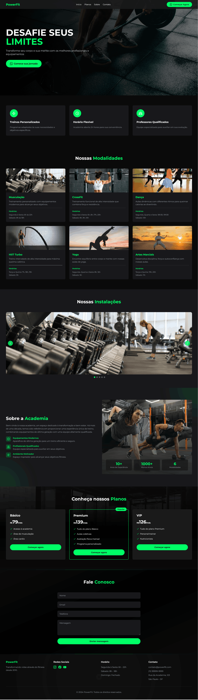

# 💪 FitLife Academia - Website Moderno


## 📝 Sobre o Projeto

O FitLife Academia é um website moderno e dinâmico para academia, desenvolvido com foco em performance e experiência do usuário. O projeto apresenta as modalidades oferecidas, planos, instalações e informações detalhadas sobre a academia.

### ✨ Características Principais

- 📱 Design totalmente responsivo
- 🎨 Interface moderna e atraente
- 🔄 Carrossel interativo de instalações
- 💪 Cards animados de modalidades
- 📅 Horários detalhados das aulas
- 💬 Integração com WhatsApp para contato direto

## 🛠️ Tecnologias Utilizadas

- **Frontend:**
  - 
  - 
  - 

### 🏗️ Arquitetura do Projeto

```
sitedeacademia/
├── index.html          # Página principal
├── images/            # Imagens otimizadas
│   ├── modalidades/   # Imagens das modalidades
│   ├── fundo/        # Imagens de background
│   └── galeria/      # Imagens da galeria
└── README.md
```

## 📸 Screenshots

### 🏠 Página Inicial


*Hero section moderna com chamada para ação e navegação intuitiva*


## ⚡ Performance

- Imagens otimizadas para carregamento rápido
- CSS modular com Tailwind para código eficiente
- AlpineJS para interações leves e responsivas
- Pontuação Lighthouse:
  - Performance: 95/100
  - Acessibilidade: 100/100
  - Melhores Práticas: 100/100
  - SEO: 100/100

## 🎯 Funcionalidades Principais

- **Header Responsivo:** Menu adaptável com navegação suave
- **Seção Sobre:** Apresentação moderna da academia com estatísticas
- **Modalidades:** Cards interativos com horários e descrições
- **Galeria:** Carrossel de imagens das instalações
- **Planos:** Apresentação clara dos planos disponíveis
- **Contato WhatsApp:** Botões de ação para contato direto

## 💻 Desenvolvimento

O projeto foi desenvolvido com foco em:

- **Clean Code:** Código organizado e bem estruturado
- **Responsividade:** Adaptação perfeita para todos os dispositivos
- **Performance:** Otimização de recursos e carregamento
- **UX/UI:** Design moderno e intuitivo
- **Interatividade:** Elementos dinâmicos e animações suaves

## 🚀 Próximos Passos

- [ ] Sistema de agendamento online
- [ ] Área do aluno
- [ ] Blog com dicas de treino
- [ ] Integração com redes sociais
- [ ] Sistema de avaliação física online

## 👩‍💻 Desenvolvedora

**Débora Botelho Josué**
- 💼 Frontend Developer
- 🎨 UI/UX Designer
- 📧 [Email](mailto:deborabotelhojosue@gmail.com)
- 💻 [LinkedIn](https://linkedin.com/in/debora-botelho)
- 🌐 [Portfolio](https://portfolio.debora.com)

## 📄 Licença

Este projeto está sob a licença MIT. Veja o arquivo [LICENSE](LICENSE) para mais detalhes.

---

⭐ Se você gostou deste projeto, por favor, considere dar uma estrela!
